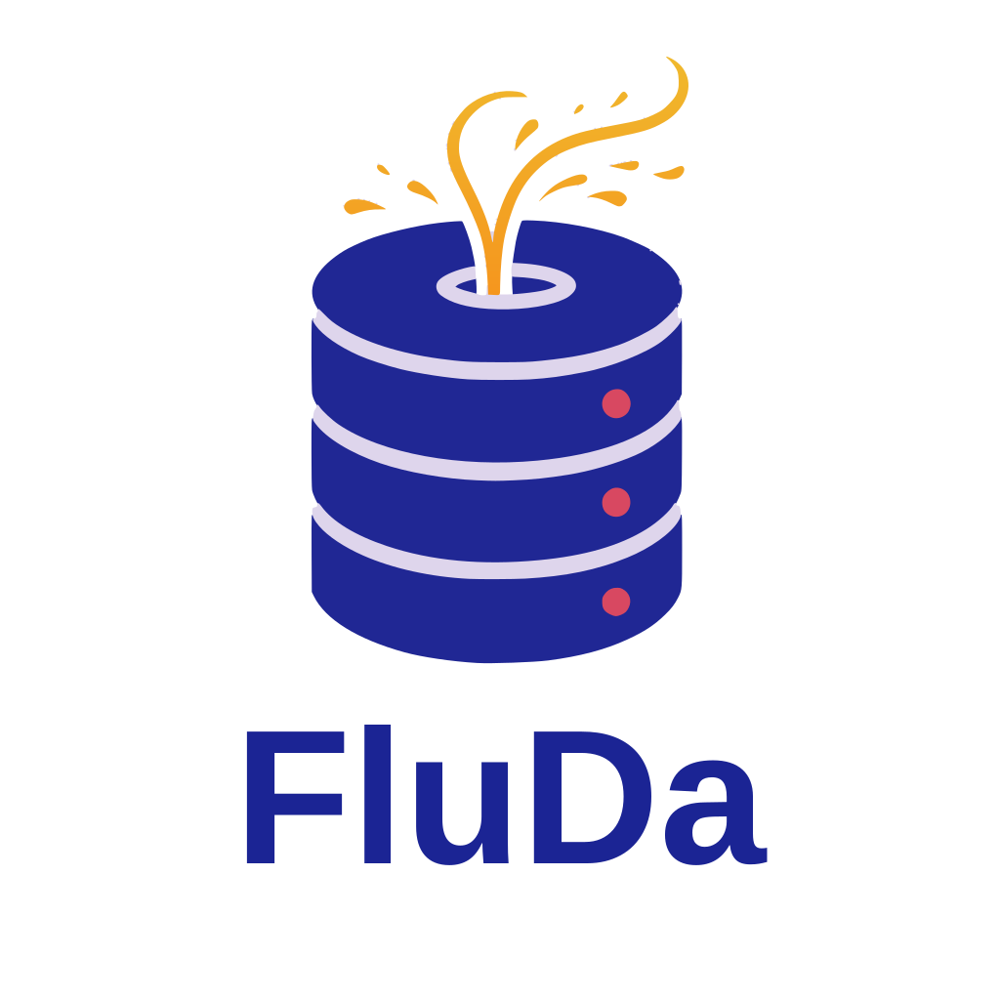

---
hide:
  - navigation
  - toc
---

<div class="hero" markdown>

<div markdown style="text-align: center;">

{ width="320" }

</div>

**Fluent Data Toolkit for Jakarta EE / CDI**

A lightweight, modular data-access suite designed for standard Jakarta EE and CDI environments. Type-safe, fluent JDBC queries — no Spring required.

[Get Started](docs/quickstart.md){ .md-button .md-button--primary }
[GitHub](https://github.com/fludakit){ .md-button }

</div>

## What is FluDa?

FluDa provides a developer-friendly, fluent programming model for data access that mirrors modern APIs like Spring's `JdbcClient` — without the bulk of a full framework. It is organized into three standalone pillars:

<div class="grid cards" markdown>

-   :material-database:{ .lg .middle } **JDBC Client**

    A lightweight, type-safe, fluent query engine built directly over JDBC.

    [:octicons-arrow-right-24: Documentation](docs/index.md)

-   :material-sync:{ .lg .middle } **SQL Initialization** *(coming soon)*

    Automates database schema management and data population on application startup.

    [:octicons-arrow-right-24: sql-init](https://github.com/fludakit/sql-init)

-   :material-transit-connection-variant:{ .lg .middle } **Transaction Support** *(coming soon)*

    Container-agnostic declarative and programmatic transaction boundaries.

    [:octicons-arrow-right-24: tx](https://github.com/fludakit/tx)

</div>

## Quick example

```java
import io.github.fludakit.jdbc.JdbcClient;

// Create a client from any DataSource
JdbcClient client = new JdbcClient(dataSource);

// Fluent queries with named parameters
List<Engineer> engineers = client.sql("SELECT id, name FROM engineers WHERE department = :dept")
        .param("dept", "Engineering")
        .query(Engineer.class)
        .list();

// Updates with generated keys
int rows = client.sql("INSERT INTO engineers (name, department) VALUES (:name, :dept)")
        .param("name", "Ada Lovelace")
        .param("dept", "Engineering")
        .update();
```

## Why FluDa?

<div class="grid cards" markdown>

-   :material-feather:{ .lg .middle } **Lightweight**

    Zero framework dependencies for the core module. Just JDBC and a `DataSource`.

-   :material-puzzle:{ .lg .middle } **Modular**

    Use only what you need — core, config, CDI, or any combination.

-   :material-server:{ .lg .middle } **Jakarta EE Native**

    Built for standard Jakarta EE and CDI. Works with GlassFish, WildFly, and any compatible server.

-   :material-language-java:{ .lg .middle } **Type-Safe**

    Fluent API with compile-time safety. POJO mapping, custom row mappers, and converter registry.

</div>

## Modules

| Module | Artifact | Description |
|--------|----------|-------------|
| **Core** | `fluda-jdbc-client-core` | Plain `JdbcClient` API — DataSource only, no CDI |
| **Config** | `fluda-jdbc-client-config` | MicroProfile Config integration |
| **CDI** | `fluda-jdbc-client-cdi` | CDI producers for `JdbcClient` and converters |

## Installation

```xml
<dependency>
    <groupId>io.github.fludakit</groupId>
    <artifactId>fluda-jdbc-client-core</artifactId>
    <version>1.0.0-SNAPSHOT</version>
</dependency>
```

See the [installation guide](docs/install.md) for all options.
